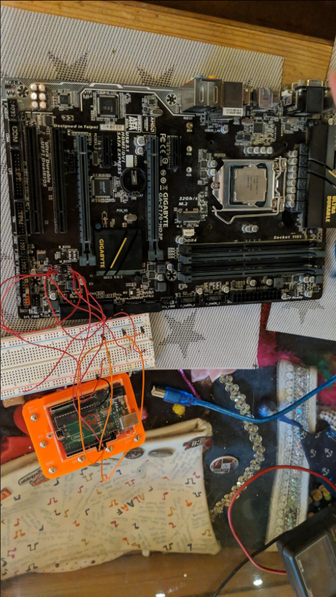
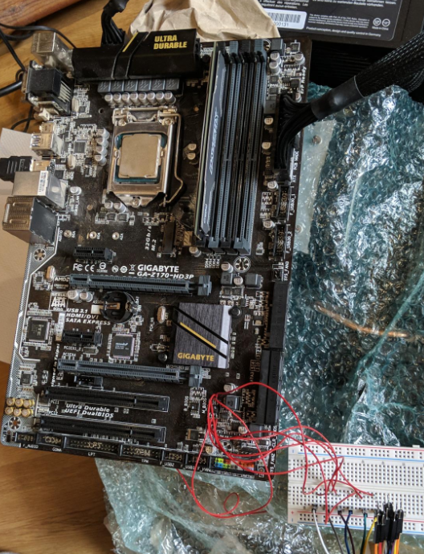
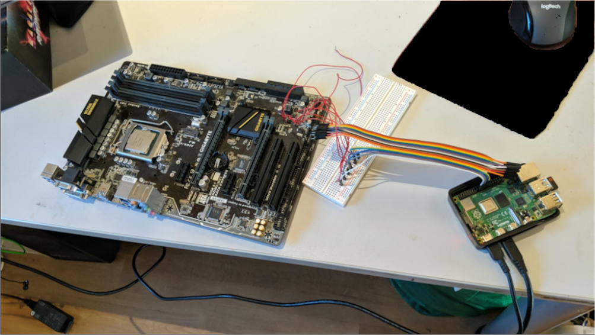
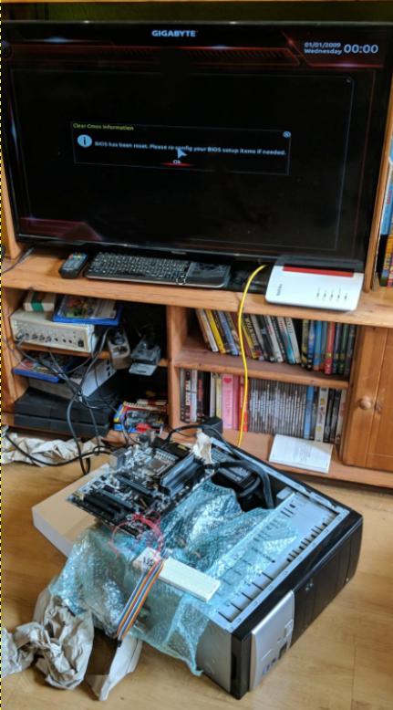

# Broken motherboard bios

## How did I do that

I somehow broke my **[Gigabyte ga z170 hd3p](https://www.gigabyte.com/de/Motherboard/GA-Z170-HD3P-rev-10)** motherboard by enabling **Secure boot**.
I've tried many things like [shorting the bios chip pins](https://superuser.com/questions/1141050/how-to-force-gigabyte-motherboard-to-boot-in-the-backup-bios-by-shorting-pins-on) which did not work.  

So I've bought a new one *(not exacly the same one)*, remembered I wanted to try around with **Secure boot** and instantly broke it the same way as my first one... I was **mad!**  

I've tried the [pin shorting](https://superuser.com/questions/1141050/how-to-force-gigabyte-motherboard-to-boot-in-the-backup-bios-by-shorting-pins-on) again and it really worked!  
On my first motherboard I had done a critical error. I've shorted the wrong pins as the chip was the opposite direction as the backup bios chip which I didn't notice.  

So even after trying again with my old motherboard, it would remain broken.

### Remembering my old broken mainboard

Multiple months later when ~~playing~~ "lagging" [Satisfactory](https://www.satisfactorygame.com/) with my friends on my self hosted server on my 2012 laptop, I really wanted a better server and I remembered my old motherboard with my old **[Intel i5 7500](https://www.intel.de/content/www/de/de/products/sku/97123/intel-core-i57500-processor-6m-cache-up-to-3-80-ghz/specifications.html)** sitting in a box. *(My new used motherboard came with the same cpu)*  

So I looked for a way to flash a new bios to the chip.

## How I fixed it

I knew there were multiple cheap programmers out there but I always wanted to do stuff by my own and don't buy anything for it.  

I searched up the specs for my [bios chip](https://www.macronix.com/Lists/Datasheet/Attachments/8640/MX25L6473E,%203V,%2064Mb,%20v1.4.pdf) and googled on how to flash a bios chip in hope the chip itself wasn't broken.  

### Attempt one (Did not work)

At some point I asked [ChatGPT](https://chatgpt.com/) and my dad who had some knowledge in programming micro controllers, on what I could do.  

We came accross [flashrom](https://www.flashrom.org/supported_hw/supported_prog/serprog/arduino_flasher.html) used together with an [arduino](https://www.arduino.cc/) to get access to the broken bios chip.
That was perfect as I had an arduino uno at home.  
I wasn't feeling great soldering wires directly onto my motherboard but it worked.

I needed to devide the voltage from 5V to around 3.3V using resistors which I found in the flashrom documentation for the arduino.

Long story short, it never worked. Flashrom just wouldn't receive a message back from the chip.
I thought I would need to solder out the chip which I wasn't feeling comfortable about.

### Final working attempt

The next day I woke up early just to go on youtube and seeing a [video](https://youtu.be/KNy-_ZzMnG0?si=AwReKGeD91BvdUIi) abount flashing an bios with an raspberry pi which I had at home ([Raspberry Pi 4](https://www.raspberrypi.com)). The best part is: The raspberry pi uses 3.3V and I wouldn't need any weird resistor combination.  

I ran flashrom which was preinstalled on Raspberry pi OS and it **FOUND THE CHIP!**  
Ok it found multiple chips but as I knew my exact chip version I've selected the one in had and use flashrom to dump the chip content.  

I then compared the content to the latest bios update I downloaded from [Gigabytes Website](https://www.gigabyte.com/Motherboard/GA-Z170-HD3P-rev-10/support#Support-Bios).
There were big differences in the files so I knew my bios was corrupt. I flashed the newest bios (from 2019) onto the chip and It worked flawless.  

I ripped out some ram and the PSU of my pc and tried to turn on the motherboard and it booted up to the bios instantly which made me unbelievable happy.

So this was my fix I hope this helps someone :)

## Images

### Trying with Arduino

### Wire salad

### Raspberry Pi finally working

### FINALLY WORKING
